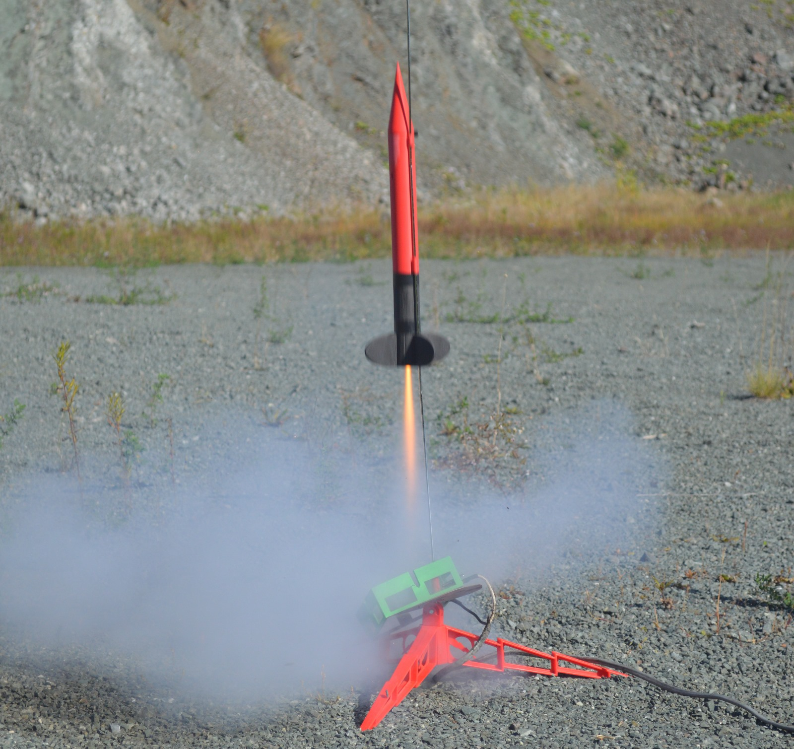

```{r setup, include=FALSE}
knitr::opts_chunk$set(echo = TRUE)
knitr::opts_chunk$set(fig.pos = "H", out.extra = "")
```


\pagebreak

```{=latex}
% Trigger ToC creation in LaTeX
\tableofcontents
\pagebreak
```

```{r loading, echo=FALSE}
source("dataPreperation.R")
```

# Goals

3D printed
Fit multiple motors
Record as much flight data as possible for "cheap"

\newpage

# Design

The design section is divided into three parts. The first covers the rocket's overall design, detailing its structure and components. The second explains the simulations conducted to evaluate the rocket's expected performance and stability. The final part outlines the features of the flight recorder and the key decisions made during its development.

## Rocket Structure

The rocket follows a traditional hobbyist design, featuring a single motor located at the base with no active guidance system \autocite{nasa_model_rockets_2024}. To ensure stability during flight, fins are positioned at the bottom. Additionally, since the rocket is intended for recovery, the nosecone must be detachable, triggered by the ejection charge from the motor. This requires the ejection blast to travel the full length of the rocket to the nosecone without damaging the on-board electronics responsible for recording flight data.
Based on these goals, the following decisions were made regarding the design and manufacturing of the rocket:


### The Case for 3D Printing

Due to the goals of affordability and easy of manufacturing the decision to use 3D printing to manufacture as many pieces of the rockets as possible was made. 
3D printing allows anybody with access to the 3D model of the rocket to produce it nearly identical. 
The widespread adoption of 3D printing for hobby projects made printers as well as filament widely available, cheap to obtain and easy use.
Therefore the rocket can not only be replicated with low complexity for the builder but also at a minimal cost or effort involved \autocite{pearce2022economic}.
Additionally the process of 3D printing allows to easily build geometries that would usually be hard or expensive to machine or produce at small production volumes and scales \autocite{berman20123, berman2020managing}.
Specifically FDM 3D printing was used to build the complete Rocket structure.

### Selected Materials

Different 3D printing filaments offer different strength or density properties that might be more beneficial to use on different parts of the rocket \autocite{bambu_filament_guide_2024}. The most used hobbyist Filament, PLA, is an all rounder, offering good toughness, strength, stiffness, layer adhesion and ease of printing for a low price per kilogram. For this reason, PLA was chosen as the default material for most parts of the rocket that aren't subjected to high forces or extreme temperatures. 

The option of printing certain components in more expensive, ultra-lightweight filaments like ASA Aero (ASA infused with a temperature-activated foaming agent) was considered. However, this approach was ultimately set aside due to the reduced strength and increased printing complexity, which limits the ability to create intricate designs to some extent.

There are 2 parts on the rocket that required further consideration before selecting the filament:
\begin{enumerate}
  \item The fins of a rocket are often quite thin and stick out of the rocket body often making contact first when impacting during soft landings or transportation. Therefore the 
  \item asdf asdfasd fasdfas d.asdf asdfa dafsdfasdfa sdfa.sdf asdfasd fasdfasdfas df.asdf asdfas df  adsfasdfasd. adsfasdf asdf asdf asdf asdfa.afsdf asdfas dfasdf asdf asd f.
\end{enumerate}


## Performance & Stability Simulations
## Flight Recording System

\newpage

# Launch
## Data Analysis
### Pressure Sensor

```{r pressure-alt, echo=FALSE, fig.cap="Altitude as measured by the pressure sensor", warning=FALSE}
ggplot(track, aes(x = Seconds)) +  # Map the converted seconds to the x-axis
  geom_line(aes(y = Altitude.Lowess, color = "Pressure LOWESS"), size = 1, linetype = "solid") +
  geom_line(aes(y = Altitude, color = "Pressure")) +
  
  # Highlight the top-most point with a horizontal line to the y-axis
  geom_segment(aes(x = min(Seconds), xend = max_seconds, y = max_alt_value, yend = max_alt_value), 
               linetype = "dashed", color = "blue", size = 0.3) +  # Dashed line to the y-axis
  
  geom_point(aes(x = max_seconds, y = max_alt_value), color = "blue", size = 2) +  # Highlight the max point with a dot
  
  # Add a label for the maximum point with adjusted positioning
  annotate("text", x = max_seconds, y = max_alt_value, label = paste("Max: ", max_alt_value,"m ±1m", sep = ""), 
           color = "blue", vjust = 1.5, hjust = 2) +  # Adjusted to prevent leaving plot area
  scale_x_continuous(breaks = pretty(track$Seconds, n = 10), labels = seconds_milliseconds) +  
  scale_color_manual(values = c("Pressure" = "grey40", "Pressure LOWESS" = "red")) +
  labs(x = "Time (s:ms)", y = "Altitude (in m)", color = NULL) +  # Add x-axis label as "Time"
  scale_y_continuous(breaks = seq(0, max(track$Altitude, na.rm = TRUE), by = 25)) +  # Set y-axis breaks to steps of 25
  theme_minimal() +
  theme(axis.text.x = element_text(angle = 45, hjust = 1),  # Rotate x-axis labels for readability
        legend.position = c(0.75, 0.12)) + # Adjust position inside plot 
  labs(title = "Altitude", 
          subtitle = "Based on BMP388 pressure measurements ±1m",
          caption = "Pathfinder launch 2024-09-29")
```

```{r pressure-speed, echo=FALSE, fig.cap="Vertical Speed as measured by the pressure sensor", warning=FALSE}
ggplot(track, aes(x = Seconds)) +  # Map the converted seconds to the x-axis
  geom_line(aes(y = Altitude.Velocity.Lowess.Pracma, color = "Vertical speed LOWESS"), size = 1, linetype = "solid") +
  geom_line(aes(y = Altitude.Velocity.Pracma, color = "Vertical speed"))  +
  ylim(-65, 65) +
   
  scale_x_continuous(breaks = pretty(track$Seconds, n = 10), labels = seconds_milliseconds) +  
  scale_color_manual(values = c("Vertical speed" = "grey40", "Vertical speed LOWESS" = "red")) +
  labs(x = "Time (s:ms)", y = "Vertical speed (in m/s)", color = NULL) +  # Add x-axis label as "Time"
  theme_minimal() +
  theme(axis.text.x = element_text(angle = 45, hjust = 1),  # Rotate x-axis labels for readability
        legend.position = c(0.85, 0.1)) + # Adjust position inside plot 
  labs(title = "Vertical speed", 
          subtitle = "Based on BMP388 pressure measurements",
          caption = "Pathfinder launch 2024-09-29")
```


```{r pressure-accel, echo=FALSE, fig.cap="Vertical Acceleration as measured by the pressure sensor", warning=FALSE}
ggplot(track, aes(x = Seconds)) +  # Map the converted seconds to the x-axis
  geom_line(aes(y = Altitude.Acceleration.Lowess.Pracma, color = "Acceleration LOWESS"), size = 1, linetype = "solid") +
  geom_line(aes(y = Altitude.Acceleration.Pracma, color = "Acceleration"))  +
  ylim(-60,60) +
  
  scale_x_continuous(breaks = pretty(track$Seconds, n = 10), labels = seconds_milliseconds) +  
  scale_color_manual(values = c("Acceleration" = "grey40", "Acceleration LOWESS" = "red")) +
  labs(x = "Time (s:ms)", y = "Acceleration (in m/s²)", color = NULL) +  # Add x-axis label as "Time"
  theme_minimal() +
  theme(axis.text.x = element_text(angle = 45, hjust = 1),  # Rotate x-axis labels for readability
        legend.position = c(0.85, 0.1)) + # Adjust position inside plot 
  labs(title = "Rocket vertical acceleration", 
       subtitle = "Based on BMP388 pressure measurements",
       caption = "Pathfinder launch 2024-09-29")
```

### Accelerometer

```{r accel-raw, echo=FALSE, fig.cap="Raw Acceleration as measured by the Accelerometer", warning=FALSE}
ggplot(track, aes(x = Seconds)) +  
  geom_line(aes(y = Acceleration_X, color = "Acceleration X"), size = 0.7)  +
  geom_line(aes(y = Acceleration_Y, color = "Acceleration Y"), size = 0.7)  +
  geom_line(aes(y = Acceleration_Z, color = "Acceleration Z"), size = 0.7)  +
  
  scale_x_continuous(breaks = pretty(track$Seconds, n = 10), labels = seconds_milliseconds) +
  labs(x = "Time (s:ms)", y = "Acceleration (in m/s²)", color = NULL) + 
  theme_minimal() +
  theme(axis.text.x = element_text(angle = 45, hjust = 1),
        legend.position = c(0.85, 0.3)) +
  labs(title = "Rocket raw acceleration", 
       subtitle = "Based on MPU6050 acceleration measurements",
       caption = "Pathfinder launch 2024-09-29")
```

```{r accel-accel, echo=FALSE, fig.cap="Total Acceleration as measured by the Accelerometer", warning=FALSE}
ggplot(track, aes(x = Seconds)) +  
  geom_line(aes(y = Acceleration_Total, color = "Acceleration"), size = 0.7)  +
  ylim(-15,60) +
  
  scale_x_continuous(breaks = pretty(track$Seconds, n = 10), labels = seconds_milliseconds) +
  labs(x = "Time (s:ms)", y = "Acceleration (in m/s²)", color = NULL) + 
  theme_minimal() +
  theme(axis.text.x = element_text(angle = 45, hjust = 1),
        legend.position = c(0.85, 0.1)) +
  labs(title = "Rocket total acceleration", 
       subtitle = "Based on MPU6050 acceleration measurements",
       caption = "Pathfinder launch 2024-09-29")
```

### Gyro

```{r gyro-raw, echo=FALSE, fig.cap="Rocket rotation during flight", warning=FALSE}
ggplot(track, aes(x = Seconds)) +  
  geom_line(aes(y = Gyro_X, color = "Pitch"), size = 0.7)  +
  geom_line(aes(y = Gyro_Y, color = "Roll"), size = 0.7)  +
  geom_line(aes(y = Gyro_Z, color = "Yaw"), size = 0.7)  +
  
  scale_x_continuous(breaks = pretty(track$Seconds, n = 10), labels = seconds_milliseconds) +
  labs(x = "Time (s:ms)", y = "Speed (in rad/s)", color = NULL) + 
  theme_minimal() +
  theme(axis.text.x = element_text(angle = 45, hjust = 1),
        legend.position = c(0.85, 0.1)) +
  labs(title = "Rocket angular speed", 
       subtitle = "Based on MPU6050 gyro measurements",
       caption = "Pathfinder launch 2024-09-29")
```

```{r gyro-angle, echo=FALSE, fig.cap="Rocket rotation during flight", warning=FALSE}
arrow_data <- track %>%
  slice(seq(1, n(), by = 5)) %>%
  mutate(
    x_end = Seconds - 0.25 * sin(angle_X),
    y_end = Altitude + 5 * cos(angle_X)
  )

# Plot with arrows instead of lines
ggplot(track, aes(x = Seconds)) +
  geom_segment(data = arrow_data,
               aes(xend = x_end, y = Altitude, yend = y_end, color = "Rocket Orientation"),
               arrow = arrow(type = "closed", length = unit(0.1, "inches")),
               size = 1, linetype = "solid") +
  scale_x_continuous(breaks = pretty(track$Seconds, n = 10), labels = seconds_milliseconds) +  
  labs(x = "Time (s:ms)", y = "Altitude (in m)", color = NULL) +  # Add x-axis label as "Time"
  scale_y_continuous(breaks = seq(0, max(track$Altitude, na.rm = TRUE), by = 25)) +  # Set y-axis breaks to steps of 25
  theme_minimal() +
  theme(axis.text.x = element_text(angle = 45, hjust = 1),  # Rotate x-axis labels for readability
        legend.position = c(0.75, 0.12)) + # Adjust position inside plot 
  labs(title = "Rocket orientation", 
       subtitle = "Based on BMP388 pressure measurements and MPU6050 angle measurements",
       caption = "Pathfinder launch 2024-09-29")
```

### GPS

https://github.com/mikalhart/TinyGPSPlus/blob/0a205759da22a1c54c5f5285480fe6132592a4e2/examples/UsingCustomFields/UsingCustomFields.ino#L27
No VDOP, interesting for altitude and most of the speed

```{r gps-hdop, echo=FALSE, fig.cap="GPD horizontal dilution of precision", warning=FALSE}
ggplot(track, aes(x = Seconds)) + 
  geom_line(aes(y = GPS_HDOP, color = "GPS HDOP"), size = 0.7, linetype = "solid") +
  scale_y_continuous(trans='log10') +
  scale_x_continuous(breaks = pretty(track$Seconds, n = 10), labels = seconds_milliseconds) +
  labs(x = "Time (s:ms)", y = "HDOP", color = NULL) + 
  theme_minimal() +
  theme(axis.text.x = element_text(angle = 45, hjust = 1), 
        legend.position = c(0.85, 0.05)) +
  labs(title = "GPD horizontal dilution of precision", 
       subtitle = "Based on BE-220 GPS, log y scale",
       caption = "Pathfinder launch 2024-09-29")
```


```{r gps-measured-speed, echo=FALSE, fig.cap="Total speed measured by GPS", warning=FALSE}
ggplot(track, aes(x = Seconds)) +  
  geom_line(aes(y = GPS_Speed_ms, color = "Speed"), size = 0.7)  +
  scale_x_continuous(breaks = pretty(track$Seconds, n = 10), labels = seconds_milliseconds) +
  labs(x = "Time (s:ms)", y = "Speed (in m/s)", color = NULL) + 
  theme_minimal() +
  theme(axis.text.x = element_text(angle = 45, hjust = 1),  
        legend.position = c(0.85, 0.1)) + 
  labs(title = "Rocket total speed", 
       subtitle = "Based on BE-220 GPS measurements",
       caption = "Pathfinder launch 2024-09-29")
```

```{r gps-measured-altitude, echo=FALSE, fig.cap="Altitude measured by GPS", warning=FALSE}
ggplot(track, aes(x = Seconds)) +  # Map the converted seconds to the x-axis
  geom_line(aes(y = GPS_Altitude.Adjusted, color = "Altitude"), size = 0.7) +
  
  # Highlight the top-most point with a horizontal line to the y-axis
  geom_segment(aes(x = min(Seconds), xend = max_seconds_gps, y = max_alt_value_gps, yend = max_alt_value_gps), 
               linetype = "dashed", color = "blue", size = 0.3) +  # Dashed line to the y-axis
  
  geom_point(aes(x = max_seconds_gps, y = max_alt_value_gps), color = "blue", size = 2) +  # Highlight the max point with a dot
  
  # Add a label for the maximum point with adjusted positioning
  annotate("text", x = max_seconds, y = max_alt_value_gps, label = paste("Max: ", max_alt_value_gps,"m ±1m", sep = ""), 
           color = "blue", vjust = 1.5, hjust = 2) +  # Adjusted to prevent leaving plot area
  scale_x_continuous(breaks = pretty(track$Seconds, n = 10), labels = seconds_milliseconds) +  
  labs(x = "Time (s:ms)", y = "Altitude (in m)", color = NULL) +  # Add x-axis label as "Time"
  scale_y_continuous(breaks = seq(0, max(track$GPS_Altitude.Adjusted, na.rm = TRUE), by = 25)) +  # Set y-axis breaks to steps of 25
  theme_minimal() +
  theme(axis.text.x = element_text(angle = 45, hjust = 1),  # Rotate x-axis labels for readability
        legend.position = c(0.75, 0.12)) + # Adjust position inside plot 
  labs(title = "Altitude", 
       subtitle = "Based on BE-220 GPS measurements",
       caption = "Pathfinder launch 2024-09-29")
```

```{r gps-horizontal-distance, echo=FALSE, fig.cap="Horizontal distance of rocket based on GPS", warning=FALSE}
ggplot(track, aes(x = Seconds)) + 
  geom_line(aes(y = Total.Distance.Horizontal.Lowess, color = "Distance Lowess"), size = 1, linetype = "solid") +
  geom_line(aes(y = Total.Distance.Horizontal, color = "Distance"), size = 0.7)  +
  scale_color_manual(values = c("Distance" = "grey40", "Distance Lowess" = "red")) +
  scale_x_continuous(breaks = pretty(track$Seconds, n = 10), labels = seconds_milliseconds) +
  labs(x = "Time (s:ms)", y = "Distance (in m)", color = NULL) + 
  theme_minimal() +
  theme(axis.text.x = element_text(angle = 45, hjust = 1), 
        legend.position = c(0.85, 0.1)) + 
  labs(title = "Horizontal Distance", 
       subtitle = "Based on BE-220 GPS",
       caption = "Pathfinder launch 2024-09-29")

```

```{r gps-horizontal-speed, echo=FALSE, fig.cap="Horizontal speed of rocket based on GPS", warning=FALSE}
ggplot(track, aes(x = Seconds)) +  
  geom_line(aes(y = GPS_Total_Horizontal_Speed, color = "Horizontal Speed"), size = 0.7)  +
  scale_x_continuous(breaks = pretty(track$Seconds, n = 10), labels = seconds_milliseconds) +
  labs(x = "Time (s:ms)", y = "Speed (in m/s)", color = NULL) +  
  theme_minimal() +
  theme(axis.text.x = element_text(angle = 45, hjust = 1),  
        legend.position = c(0.85, 0.1)) + 
  labs(title = "Horizontal Speed", 
       subtitle = "Based on BE-220 GPS",
       caption = "Pathfinder launch 2024-09-29")
```


```{r gps-2d, echo=FALSE, fig.cap="2D position of rocket based on GPS", warning=FALSE}
ggplot(data = track_unique, aes(x = GPS_Longitude, y = GPS_Latitude)) + 
  geom_segment(aes(xend = lead(GPS_Longitude), yend = lead(GPS_Latitude), 
                   color = Altitude), 
               arrow = arrow(length = unit(0.15, "cm")),  
               alpha = 1,
               size = 0.8) +
  scale_color_gradientn(colors = c("darkgreen", "olivedrab", "goldenrod", "darkgoldenrod", "red"),
                        limits = c(0, 140), 
                        oob = scales::squish,
                        name = "Altitude") +  
  labs(x = "Longitude", y = "Latitude") +     
  theme_minimal() + 
  labs(title = "2D position of rocket", 
       subtitle = "Based on BE-220 GPS",
       caption = "Pathfinder launch 2024-09-29")


```


```{r gps-baro-3d, echo=FALSE, fig.cap="3D position of rocket based on GPS and Barometer data", warning=FALSE, fig.show='hold',fig.align='center', out.height="35%"}
chart <- plot_ly(track_unique, 
                 x = ~GPS_Longitude, 
                 y = ~GPS_Latitude, 
                 z = ~Altitude,  
                 type = 'scatter3d', 
                 mode = 'lines+markers',  
                 line = list(width = 2, color = ~Altitude, colorscale = 'Viridis'),  
                 marker = list(size = 4, color = ~Altitude, colorscale = 'Viridis')) %>%
  layout(scene = list(xaxis = list(title = 'Longitude'),
                      yaxis = list(title = 'Latitude'),
                      zaxis = list(title = 'Altitude'),
                      camera = list(
                        eye = list(x = -2, y = 1, z = .5), 
                        up = list(x = 0, y = 0, z = 1),  
                        center = list(x = 0, y = 0, z = 0)  
                      )))


chart2 <- plot_ly(track_unique, 
                 x = ~GPS_Longitude, 
                 y = ~GPS_Latitude, 
                 z = ~Altitude,  
                 type = 'scatter3d', 
                 mode = 'lines+markers', 
                 line = list(width = 2, color = ~Altitude, colorscale = 'Viridis'), 
                 marker = list(size = 4, color = ~Altitude, colorscale = 'Viridis')) %>%
  layout(scene = list(xaxis = list(title = 'Longitude'),
                      yaxis = list(title = 'Latitude'),
                      zaxis = list(title = 'Altitude'),
                      camera = list(
                        eye = list(x = -1, y = -1, z = 2),  
                        up = list(x = 0, y = 0, z = 2),
                        center = list(x = 0, y = 0, z = 0) 
                      )))


# Save the widget to an HTML file
htmlwidgets::saveWidget(widget = chart, file = "tmp/gps3d-1.html")
htmlwidgets::saveWidget(widget = chart2, file = "tmp/gps3d-2.html")

# Take a screenshot of the HTML file to save as PNG
discard <- webshot2::webshot("tmp/gps3d-1.html", file = "tmp/gps3d-1.png", vwidth = 800, vheight = 800, zoom = 2)
discard <- webshot2::webshot("tmp/gps3d-2.html", file = "tmp/gps3d-2.png", vwidth = 800, vheight = 800, zoom = 2)


knitr::include_graphics(c("tmp/gps3d-1.png","tmp/gps3d-2.png"))
```


```{r gps-baro-distance, echo=FALSE, fig.cap="Total distance covered by rocket based on GPS and Barometer", warning=FALSE}
ggplot(track, aes(x = Seconds)) + 
  geom_line(aes(y = Total.Distance.Lowess, color = "Distance LOWESS"), size = 0.7, linetype = "solid") +
  geom_line(aes(y = Total.Distance, color = "Distance"), size = 0.7)  +
  scale_x_continuous(breaks = pretty(track$Seconds, n = 10), labels = seconds_milliseconds) +
  labs(x = "Time (s:ms)", y = "Distance in m", color = NULL) + 
  theme_minimal() +
  theme(axis.text.x = element_text(angle = 45, hjust = 1), 
        legend.position = c(0.85, 0.1)) +
  labs(title = "Rocket total distance covered", 
       subtitle = "Based on BE-220 GPS and BMP388 pressure measurements",
       caption = "Pathfinder launch 2024-09-29")
```

```{r gps-baro-speed, echo=FALSE, fig.cap="Total speed of rocket based on GPS and Barometer", warning=FALSE}
ggplot(track, aes(x = Seconds)) + 
  geom_line(aes(y = GPS_Baro_Total_Speed, color = "Speed"), size = 0.7)  +
  scale_x_continuous(breaks = pretty(track$Seconds, n = 10), labels = seconds_milliseconds) +
  labs(x = "Time (s:ms)", y = "Speed (in m/s)", color = NULL) +  
  theme_minimal() +
  theme(axis.text.x = element_text(angle = 45, hjust = 1), 
        legend.position = c(0.85, 0.1)) +
  labs(title = "Rocket total speed", 
       subtitle = "Based on BE-220 GPS and BMP388 pressure measurements",
       caption = "Pathfinder launch 2024-09-29")

```

```{r gps-baro-speed-overlay, echo=FALSE, fig.cap="Total speed of rocket compared to vertical speed", warning=FALSE}
ggplot(track, aes(x = Seconds)) +  
  geom_line(aes(y = GPS_Baro_Total_Speed, color = "Total Vertical Speed (pressure + gps)"), size = 0.7)  +
  geom_line(aes(y = Altitude.Velocity.Lowess.Pracma.Abs, color = "Total Speed (pressure only)"), size = 0.7)  +
  scale_x_continuous(breaks = pretty(track$Seconds, n = 10), labels = seconds_milliseconds) +
  labs(x = "Time (s:ms)", y = "Speed (in m/s)", color = NULL) + 
  theme_minimal() +
  theme(axis.text.x = element_text(angle = 45, hjust = 1),
        legend.position = c(0.85, 0.1)) + 
  labs(title = "Rocket total speed compared", 
       subtitle = "Based on BE-220 GPS and BMP388 pressure measurements",
       caption = "Pathfinder launch 2024-09-29")
```

```{r gps-baro-altitude-comparison, echo=FALSE, fig.cap="Comparison of GPS and barometer altitude measurements", warning=FALSE}
ggplot(track, aes(x = Seconds)) + 
  geom_line(aes(y = GPS_Altitude.Adjusted, color = "Altitude GPS (unsynced)"), size = 0.5, linetype = "solid") +
  geom_line(aes(y = GPS_Altitude.Adjusted.NoDelay, color = "Altitude GPS (synced with peak)"), size = 0.7, linetype = "solid") +
  geom_line(aes(y = Altitude, color = "Altitude pressure sensor"), size = 0.7)  +
  geom_segment(aes(x = max_seconds, xend = max_seconds, y = max_alt_value_gps, yend = max_alt_value), 
               linetype = "dashed", color = "black", size = 0.6) +  
  geom_point(aes(x = max_seconds, y = max_alt_value_gps), color = "red", size = 2) +  
  geom_point(aes(x = max_seconds, y = max_alt_value), color = "blue", size = 2) + 
  annotate("text", x = max_seconds, y = max_alt_value + abs(max_alt_value_gps - max_alt_value) / 2, label = paste(abs(max_alt_value_gps - max_alt_value),"m", sep = ""), 
           color = "black", vjust = 0.75, hjust = 1.2) +
  scale_x_continuous(breaks = pretty(track$Seconds, n = 10), labels = seconds_milliseconds) +
  labs(x = "Time (s:ms)", y = "Distance (in m)", color = NULL) + 
  theme_minimal() +
  theme(axis.text.x = element_text(angle = 45, hjust = 1), 
        legend.position = c(0.85, 0.1)) + 
  labs(title = "Altitude measurement comparison", 
       subtitle = "Based on BE-220 GPS and BMP388 measurements",
       caption = "Pathfinder launch 2024-09-29")

```

```{r speed-roll, echo=FALSE, fig.cap="Correlation between speed and roll", warning=FALSE}

scale_factor <- 4.5  

ggplot(track, aes(x = Seconds)) +  
  geom_line(aes(y = GPS_Baro_Total_Speed, color = "Rocket total speed"), size = 0.7) +
  geom_line(aes(y = Gyro_Y * scale_factor, color = "Roll"), size = 0.7) +  
  
  scale_y_continuous(
    name = "Speed (in m/s)",
    sec.axis = sec_axis(~./scale_factor, name = "Gyro Y (in rad/s)") 
  ) +
  scale_x_continuous(breaks = pretty(track$Seconds, n = 10), labels = seconds_milliseconds) +
  labs(x = "Time (s:ms)", color = NULL) + 
  theme_minimal() +
  theme(axis.text.x = element_text(angle = 45, hjust = 1),
        legend.position = c(0.85, 0.1)) +
  labs(title = "Rocket angular speed", 
       subtitle = paste("Correlation between roll and speed: ", 
                        round(cor(track$GPS_Baro_Total_Speed, track$Gyro_Y),digits =3)),
       caption = "Pathfinder launch 2024-09-29")

```

## Failure Analysis - Parachute, SD-Card, GPS VDOP and satellites

\newpage

# Conclusion
## Critical Reflection
## Next steps

\newpage

This is an R Markdown document. Markdown is a simple formatting syntax for authoring HTML, PDF, and MS Word documents. For more details on using R Markdown see <http://rmarkdown.rstudio.com>.

When you click the **Knit** button a document will be generated that includes both content as well as the output of any embedded R code chunks within the document. You can embed an R code chunk like this:

```{r cars}
summary(cars)
```

## Including Plots

You can also embed plots, for example:

```{r pressure, echo=FALSE, dpi=500, fig.cap="This is my plot"}
plot(pressure)
```

Note that the `echo = FALSE` parameter was added to the code chunk to prevent printing of the R code that generated the plot  
